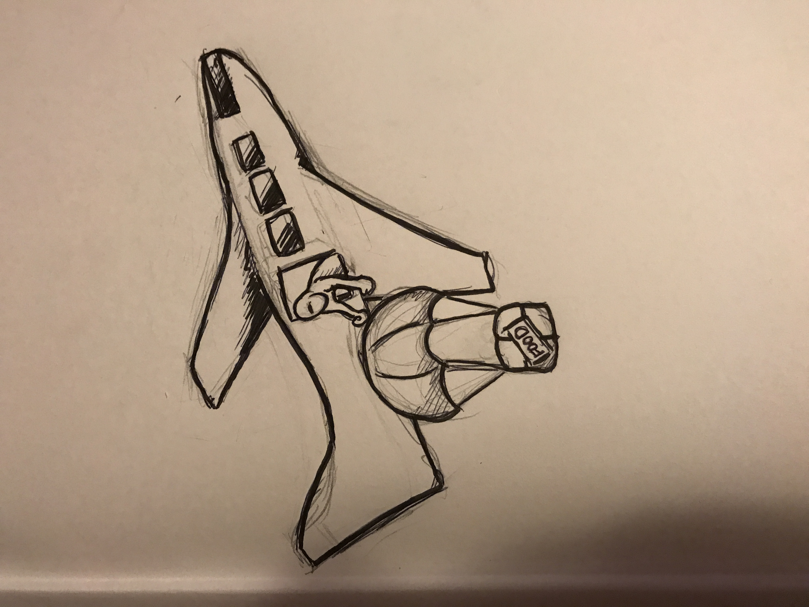
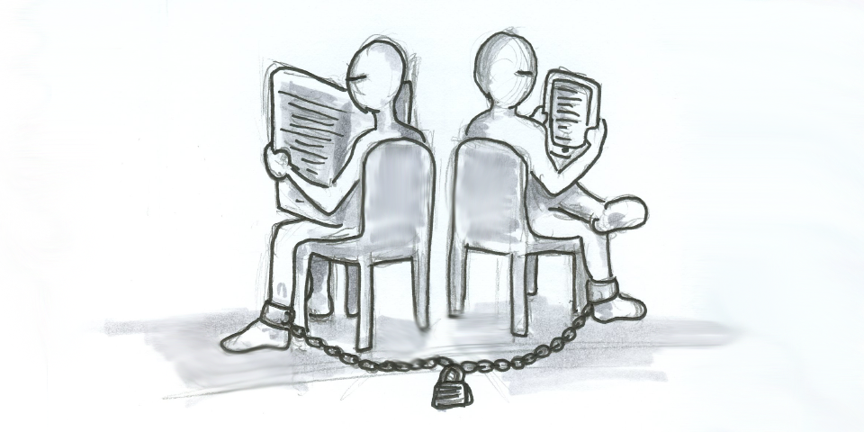

# Work in Progress Repo
https://mainetti-vincent.github.io/ebb-flow/
# Best Practices
https://mainetti-vincent.github.io/best-practices/
# Summary 
- Draft
- Revision 1 - Traditionally designers used HTML to create web pages, but now HTML is used for the frame work of a page and CSS to suggest the appearance. By doing this it allows for the web browsers to read, and display the web pages even if there are elements or aspects that are not recognized. The advantage in designing web pages this way is increased functionality across different browsers, operating systems, and devices. Not everyone has optimal vision, and some may need to increase font size to read web pages. Some may be color blind, and need the emphasized words to read as emphasized without with use of color. A good way to remember this is that function is more important than aesthetic.

Throughout the article, Allsopp give a few tips to the reader on what can be done to increase the adaptability and accessibility of web pages. The most important in these tips is for designers to stop trying to “control” the web, rather let the web respond to direction. Avoid absolute values, such as point size for fonts, instead let the viewer changes the font to the appropriate size for their needs. If a specific size difference between a header, footer, or body text is desired try using proportional sizing. Proportional sizing methods can be used to suggest the size of margins, and images also. If a designer is still concerned about “exactly how” a page look then they have not yet grasped this concept.
- Revision 2 - As a whole we tend to treat new mediums in the manner we handle the most closely related existing familiar medium. Such was the case with the web being treated like paper.In reality the web is constantly changing, and we as designers should do our best to compliment this attribute of the web. **Content must come first, and accessibility with adaptability must be emphasized explicitly.**

Traditionally designers used HTML to create web pages, but now HTML is used for the frame work of a page and CSS to suggest the appearance. By doing this it allows for the web browsers to read, and display the web pages even if there are elements or aspects that are not recognized. The advantage in designing web pages this way is increased functionality across different browsers, operating systems, and devices. Not everyone has optimal vision, and some may need to increase font size to read web pages. Some may be color blind, and need the emphasized words to read as emphasized without with use of color. A good way to remember this is that function is more important than aesthetic.

Throughout the article, Allsopp give a few tips to the reader on what can be done to increase the adaptability and accessibility of web pages. The most important in these tips is for designers to stop trying to “control” the web, rather let the web respond to direction. Avoid absolute values, such as point size for fonts, instead let the viewer changes the font to the appropriate size for their needs. If a specific size difference between a header, footer, or body text is desired try using proportional sizing. Proportional sizing methods can be used to suggest the size of margins, and images also. If a designer is still concerned about “exactly how” a page look then they have not yet grasped this concept.
- - -
# Images
- Version 1 
- Version 2 
- Version 3
- Version 4 
- Version 5 
- - -
# About the Author
- Draft - A student at Montserrat College of Art, majoring in graphic design. Some hobbies are art, design, hiking, videogames, and technology.
- Revision - 
At a young age, I discovered a strong interest in papers, pencils and pens. This interest quickly developed into a love for the arts. I spent most of my young life drawing as much as I could, and learned that art provided me a level of enjoyment I couldn’t find elsewhere. As I grew older my interests migrated towards technology, and I found myself spending time navigating this new online world. Eventually I found myself with an Associate’s degree in art studies, it was at that point that I realized that I wanted to do more than just study the arts. I wanted to create using the technology that enticed me as a child. Graphic design was the perfect combination of the arts and technology, and in 2015 I began my journey towards becoming a designer. I enrolled at my local community college with the goal of a second Associate’s degree. I graduated in 2017 with several academic awards, and am now pursuing a Bachelor’s of Fine Arts at Montserrat College of Art.
- - -
## Images
- Version 1 
- Version 2 
- Version 3 
- - -
# final-product 
- A Summary of a Dao of Web Design - https://mainetti-vincent.github.io/ebb-and-flow-final/
